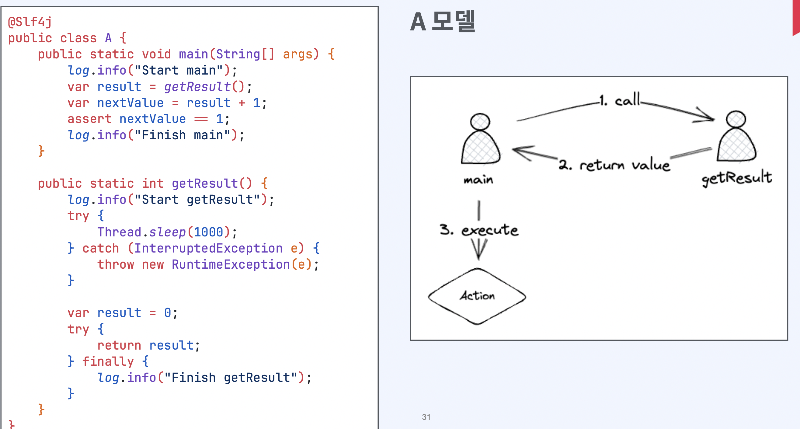
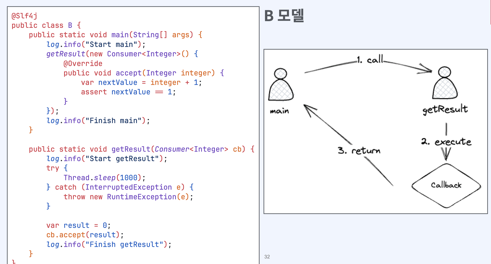
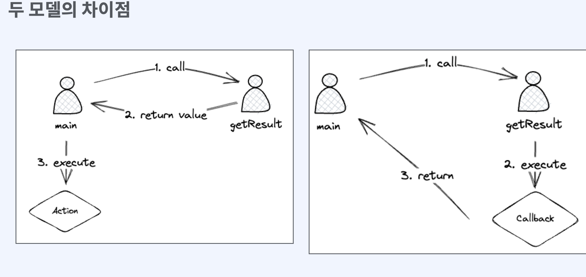
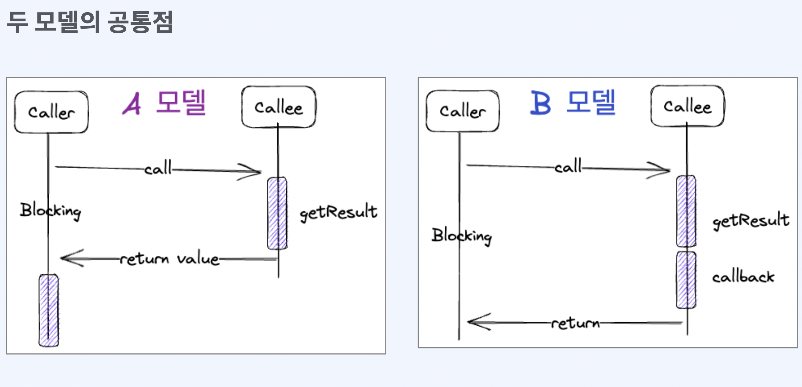
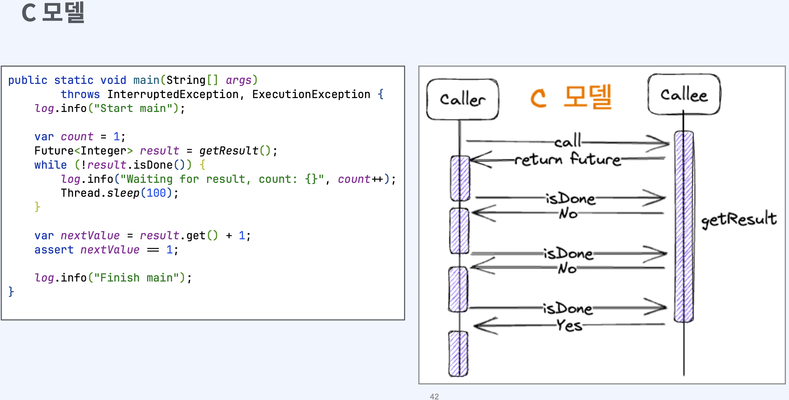
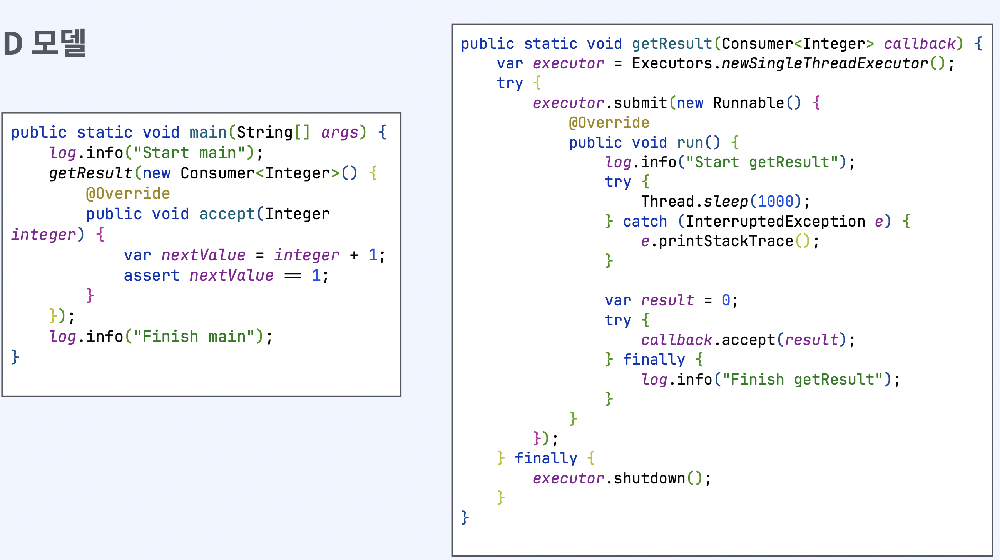
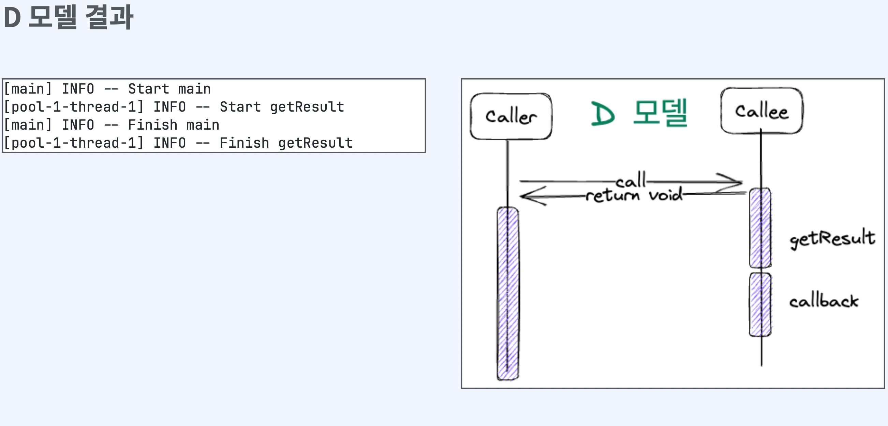
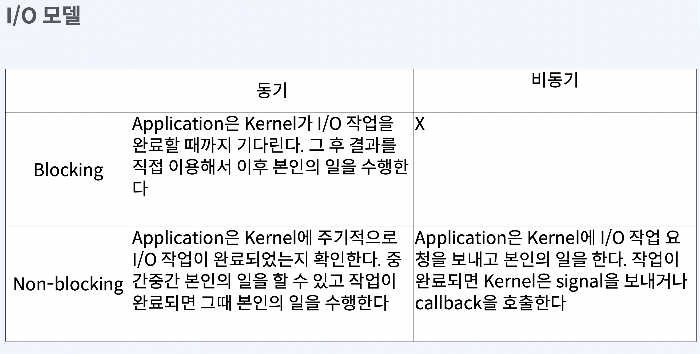

# 함수 관점에서 동기와 비동기의 차이

## Caller와 Callee

- 함수가 다른 함수를 호출하는 상황
- `Caller` : 호출하는 함수
- `Callee` : 호출 당하는 함수

## 함수형 인터페이스
- 함수형 프로그래밍을 지원하기 위해 java 8부터 도입
- 1개의 추상메서드를 가지고 있음
- 함수를 1급객체로 사용할 수 있다
  - 함수를 변수에 할당하거나 인자로 전달하고 반환값으로 사용가능
- 함수형 인터페이스는 호출한 쓰레드에서 실행됨

두 모델의 차이

A 모델 
- main은 getReulst의 결과에 관심이 있다 
- main은 결과를 이용해서 다음 코드를 실행한다

B 모델
- main은 getResult의 결과에 관심이 없다
- getResult는 결과를 이용해서 함수형 인터페이스를 실행한다

# 함수 관점에서 blocking과 non-blocking 차이

A모델 (동기 Blocking)

- main은 getResult가 결과를 돌려주기 전까지 아무것도 할 수 없다
- main은 getResult가 완료될 때까지 대기한다

B모델 (비동기 Blocking)

- main은 getResult가 결과를 구하고 callback을 실행하기 전까지 아무것도 할 수 없다
- main은 getResult가 완료될 때까지 대기한다

#### `Blocking`
- callee를 호출한 후, callee가 완료되기 전까지 caller가 아무것도 할 수 없다
- 제어권을 callee가 가지고 있다
- caller와 다른 별도의 thread가 필요하지 않다(혹은 thread를 추가로 쓸 수도 있다)

A모델과 다르게 callee가 진행중임에도 thread sleep하거나 로그를 찍거나 하는 차이가 있다

A모델 (동기 Blocking)

- getResult를 호출한 후, getResult가 완료되지 않으면 main은 본인의 일을 할 수 없다

C모델 (동기 Non-Blocking)

- getResult를 호출한 후, getResult가 완료되지 않더라도 main은 본인의 일을 할 수 있다

### `Non-Blocking`
- callee를 호출한 후, callee가 완료되지 않더라도 calleer는 본인의 일을 할 수 있다
- 제어권을 caller가 가지고 있다
- caller와 다른 별도의 thread가 필요하다

D모델 (비동기 Non-Blocking)
- main은 getResult의 결과에 관심이 없다
  - 비동기이다
- getResult를 호출한 후, getResult가 완료되지 않더라도 main은 본인의 일을 할 수 있다
  - non-blocking이다
- 즉, D모델은 비동기 non-blocking모델

# IO 관점에서 blocking과 non-blocking의 차이

### Blocking의 종류
- blocking은 thread가 오랜 시간 일을 하거나 대기하는 경우 발생
- CPU-bound blocking: 오랜 시간 일을 한다
- IO-bound blocking: 오랜 시간 대기한다

`CPU-bound blocking`
- thread가 대부분의 시간 CPU 점유
- 연산이 많은 경우
- 추가적인 코어를 투입

`IO-bound blocking`
- thread가 대부분의 시간을 대기
- 파일 읽기/쓰기, network요청 처리, 요청 전달 등
- IO-bound non-blocking 가능하다

### Blocking의 전파
- 하나의 함수에서 여러 함수를 호출하기도 하고, 함수 호출은 중첩적으로 발생
- callee는 caller가 되고 다시 다른 callee를 호출
- blocking한 함수를 하나라도 호출한다면 caller는 blocking이 된다
- 함수가 non-blocking하려면 모든 함수가 non-blocking이어야 한다
- 따라서 I/O bound blocking 또한 발생하면 안된다

I/O모델에서의 비교

