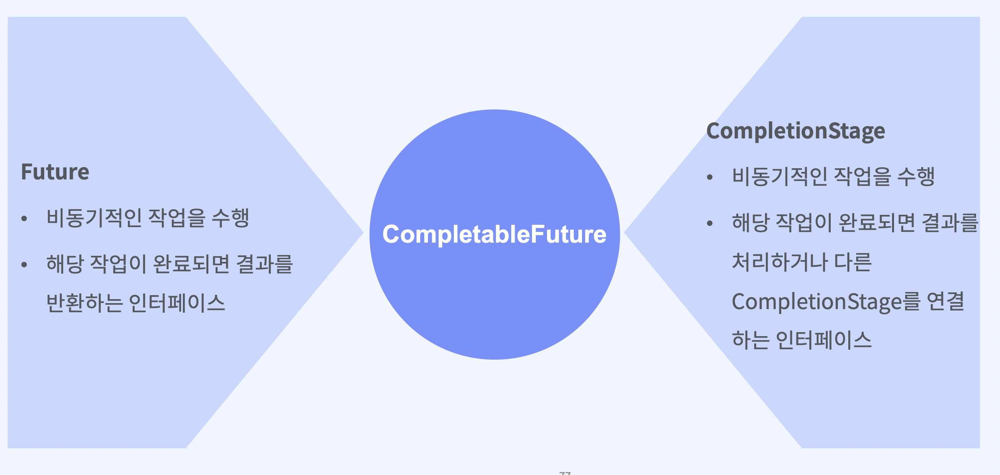
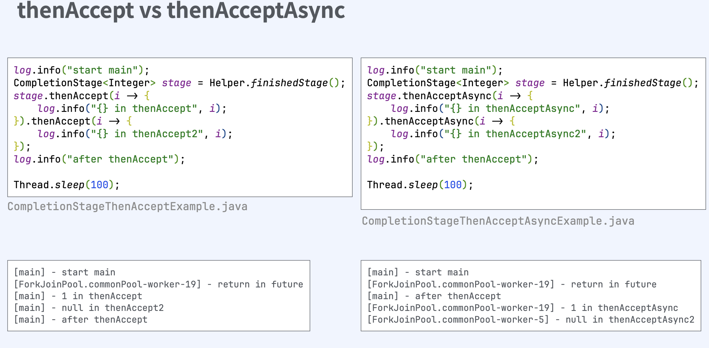
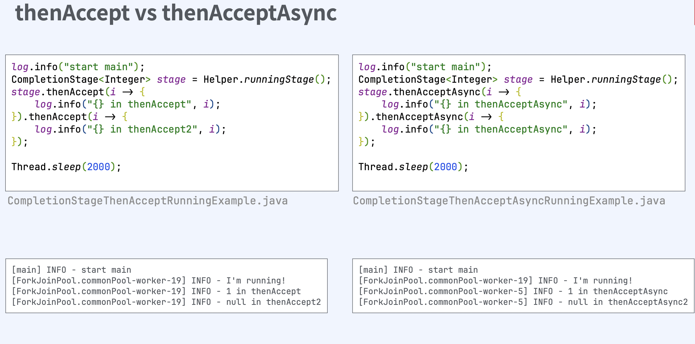
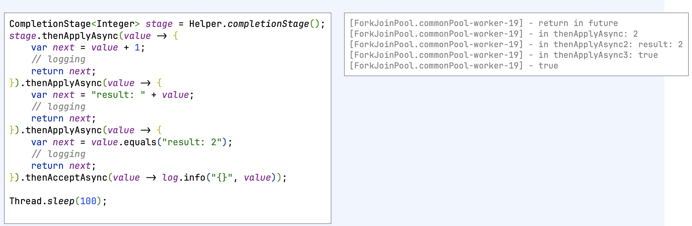
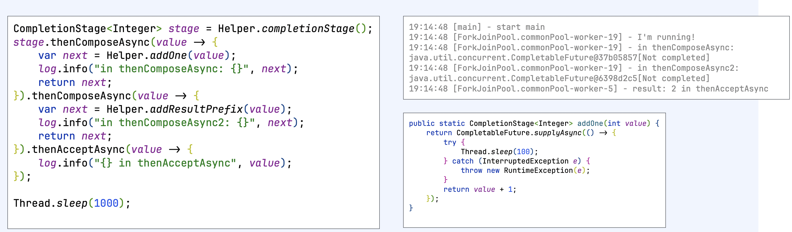
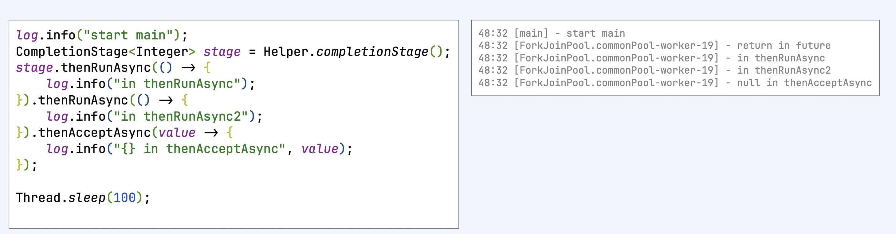
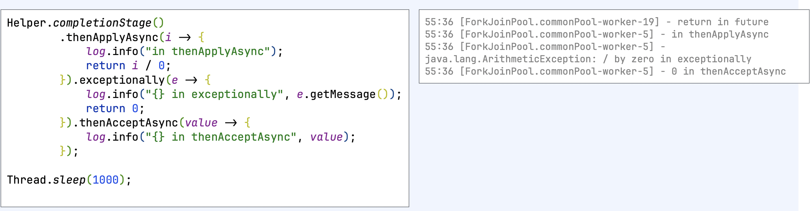

# Future 인터페이스

### CompletableFuture클래스

```java
public class CompletableFuture<T> implements
    Future<T>, CompletionStage<T>
```



### Future인터페이스

```java
public interface Future<V> {
    boolean cancel(boolean mayInterruptIfRunning);
    boolean isCancelled();
    boolean isDone();
    V get() throws InterruptedException, ExecutionException;
    V get(long timeout, TimeUnit unit) throws
        InterruptedException, ExecutionException, TimeoutException;
}
```

`참고 : ExceutorService`
- 쓰레드 풀을 이용하여 비동기적으로 작업을 실행하고 관리
- 별도의 쓰레드를 생성하고 관리하지 않아도 되므로, 코드를 간결하게 유지 가능
- 쓰레드 풀을 이용하여 자원을 효율적으로 관리

```java
public interface ExecutorService extends Executor {
    void execute(Runnable command);
    <T> Future<T> submit(Callable<T> task);
    void shutdown();
}
```
- execute : Runnable 인터페이스를 구현한 작업을 쓰레드 풀에서 비동기적으로 실행
- submit : Callable 인터페이스를 구현한 작업을 쓰레드 풀에서 비동기적으로 실행하고, 해당 작업의 결과를 Future로반환
- shutdown: ExecutorService를 종료. 더이상 task를 받지 않음

`Executors - ExecutorService 생성`
- newSingleThreadExecutor : 단일 쓰레드로 구성된 스레드 풀을 생성. 한번에 하나의 작업만 실행
- newFixedThreadPool : 고정된 크기의 쓰레드 풀을 생성. 크기는 인자로 주어진 n과 동일
- newCachedThreadPool : 사용 가능한 쓰레드가 없다면 새로 생성해서 작업을 처리하고, 있다면 재사용. 쓰레드가 일정 시간 사용되지 않으면 회수
- newScheduledThreadPool : 스케줄링 기능을 갖춘 고정 크기의 쓰레드 풀을 생성. 주기적이거나 지연이 발생하는 작업을 실행
- newWorkStealingPool : work steal 알고리즘을 사용하는 ForkJoinPool을 생성

### Future의 메소드
- `isDone` : task가 완료되었다면, 원인과 상관없이 true 반환
- `isCancelled` : task가 명시적으로 취소된 경우, true 반환
- `get` : 결과를 구할 때까지 thread가 계속 block. futre에서 무한 루프나 오랜 시간이 걸린다면 thread가 block유지
- `get(long timeout, TimeUnit unit)` 
  - 결과를 구할 때까지 timeout동안 thread가 block
  - timeout이 넘어가도 응답이 반환되지 않으면 TimeoutException 발생
- `cancel(boolean mayInterruptifRunning)`
  - future의 작업 실행을 취소
  - 취소할 수 없는 상황이라면 false를 반환
  - mayInterruptIfRunning가 false라면 시작하지 않은 작업에 대해서만 취소

### Future 인터페이스의 한계
- cancel을 제외하고 외부에서 future을 컨트롤 할 수 없다
- 반환된 결과를 get()해서 접근하기 때문에 비동기 처리가 어렵다
- 완료되거나 에러가 발생했는지 구분하기 어렵다

---

# CompletableStage 인터페이스

```java
public interface CompletionStage<T> {
public <U> CompletionStage<U> thenApply(Function<? super T,? extends U> fn); 
public <U> CompletionStage<U> thenApplyAsync(Function<? super T,? extends U> fn);

public CompletionStage<Void> thenAccept(Consumer<? super T> action); 
public CompletionStage<Void> thenAcceptAsync(Consumer<? super T> action);

public CompletionStage<Void> thenRun(Runnable action); public CompletionStage<Void> thenRunAsync(Runnable action);

public <U> CompletionStage<U> thenCompose(Function<? super T, ? extends CompletionStage<U!>> fn); 
public <U> CompletionStage<U> thenComposeAsync(Function<? super T, ? extends CompletionStage<U!>> fn);

public CompletionStage<T> exceptionally(Function<Throwable, ? extends T> fn); }
```

### CompletionStage 연산자 조합
- 50개에 가까운 연산자들을 활용하여 비동기 task들을 실행하고 값을 변형하는 등 caching을 이용한 조합 간으
- 에러를 처리하기 위한 콜백 제공

```java
Helper.completionStage().thenApplyAsync(value !-> {
  log.info("thenApplyAsync: {}", value);
return value + 1; }).thenAccept(value !-> {
  log.info("thenAccept: {}", value); }).thenRunAsync(() !-> {
  log.info("thenRun"); }).exceptionally(e !-> {
  log.info("exceptionally: {}", e.getMessage());
            return null;
        });
Thread.sleep(100);
```

### ForkJoinPool - thread pool
- CompletableFuture는내부적으로비동기함 수들을 실행하기 위해 ForkJoinPool을 사용
- ForkJoinPool의 기본 size = 할당된 cpu 코어 -1
- 데몬 쓰레드. main 쓰레드가 종료되면 즉각적으 로종료

### ForkJoinPool - fork & join
- Task를fork를통해서subtask로나누고
- Thread pool에서 steal work 알고리즘을 이용해서 균등하게 처리해서
- join을 통해서 결과를 생성

### CompletionStage 연산자
#### `thenAccept[Async]`
- COnsumer를 파라미터로 받음
- 이전 task로부터 값을 받지만 값을 넘기지 않음.
- 다음 task에게 null이 전달도미
- 값을 받아서 action만 수행하는 경우 유용
```java
CompletionStage<Void> thenAccept(Consumer<? super T> action);
CompletionStage<Void> thenAcceptAsync(Consumer<? super T> action);
```



`thenAccept[Async]의 실행 쓰레드`
- done상태에서thenAccept는caller(main)의 쓰레드에서 실행
- done상태의completionStage에 thenAccept를 사용하는 경우, caller 쓰레드를 block할수있다



`thenAccept[Async]의 실행 쓰레드`
- done 상태가 아닌 thenAccept는 callee(forkJoinPool)의 쓰레드에서 실행
- done 상태가 아닌 completionStage에 thenAccept를 사용하는 경우, callee를 block할수있다

#### `thenApply[Async]`
- Function을 파라미터로 받는다
- 이전 task로부터 T타입의 값을 받아서 가공하고 U타입의 값을 반환한다
- 다음 task에게 반환했던 값이 전달된다
- 값을 변형해서 전달해야 하는 경우 유용

```java
<U> CompletionStage<U>
  thenApply(Function<? super T,? extends U> fn);
<U> CompletionStage<U>
  thenApplyAsync(Function<? super T,? extends U> fn);
```



#### `thenCompose[Async]`
- Function을 파라미터로 받는다
- 이전 task로부터 T타입의 값을 받아서 가공하고 U타입의 CompletionStage를 반환한다
- 반환한 CompletionStage가 done상태가 되면 값을 다음 task에 전달한다
- 다른 future를 반환해야하는 경우 유용

```java
<U> CompletionStage<U> thenCompose(
  Function<? super T, ? extends CompletionStage<U!>> fn);
<U> CompletionStage<U> thenComposeAsync(
  Function<? super T, ? extends CompletionStage<U!>> fn);
```



#### `thenRun [Async]`
- Runnable을 파라미터로 받는다
- 이전 task로부터 값을 받지않고 값을 반환하지 않는다
- 다음 task에게 null이 전달된다
- future가 완료되었다는 이벤트를 기록할 때 유용

```java
public CompletionStage<Void> thenRun(Runnable action); 
public CompletionStage<Void> thenRunAsync(Runnable action);
```



#### `exceptionally`
- Function을 파라미터로 받는다
- 이전 task에서 발생한 exception을 받아서 처리하고 값을 반환한다
- 다음 task에게 반환된 값을 전달한다
- future 파이프에서 발생한 에러를 처리할때 유용

```java
CompletionStage<T> exceptionally( Function<Throwable, ? extends T> fn);
```

