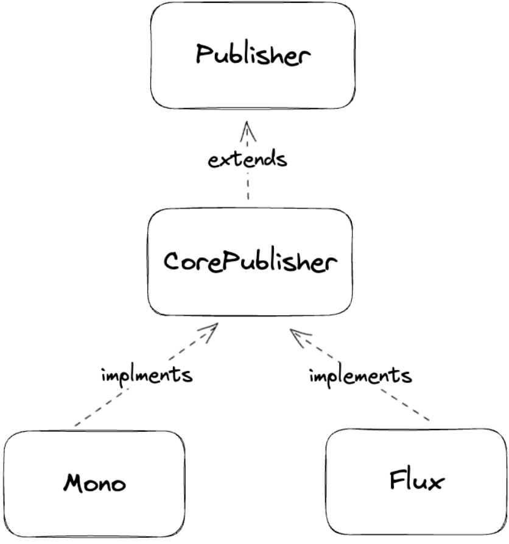
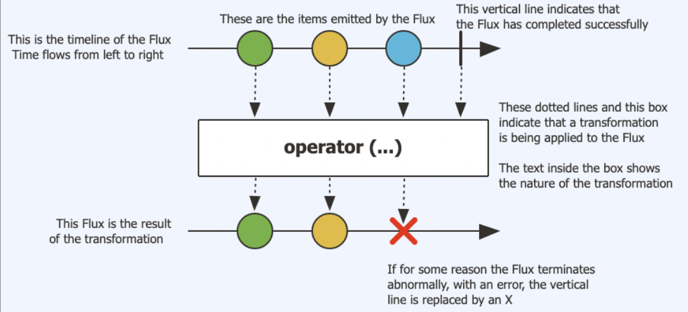
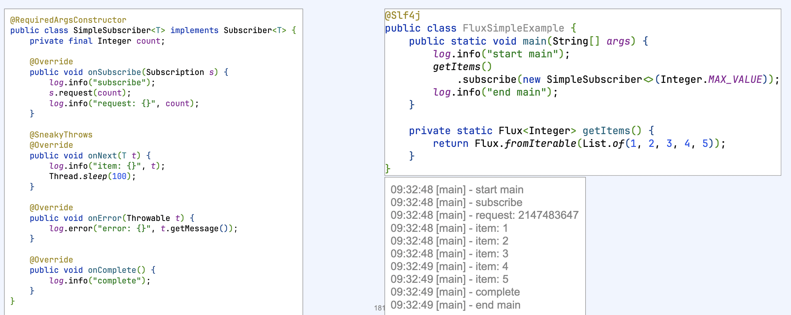
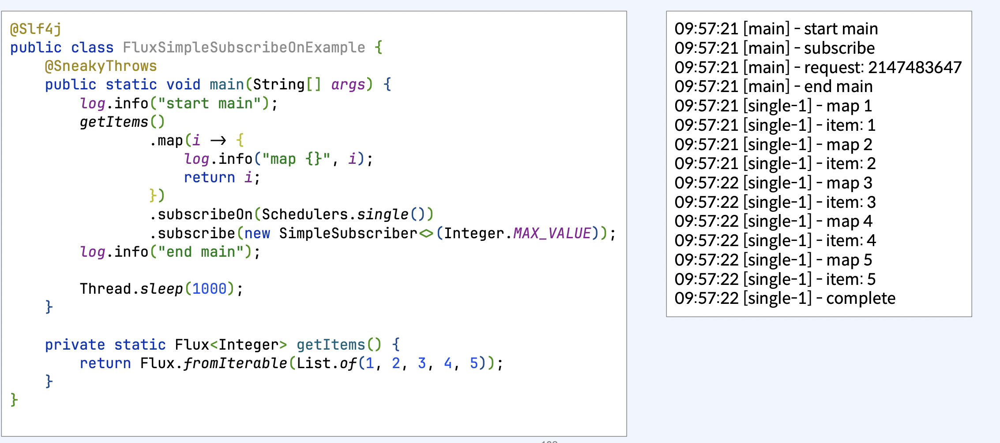
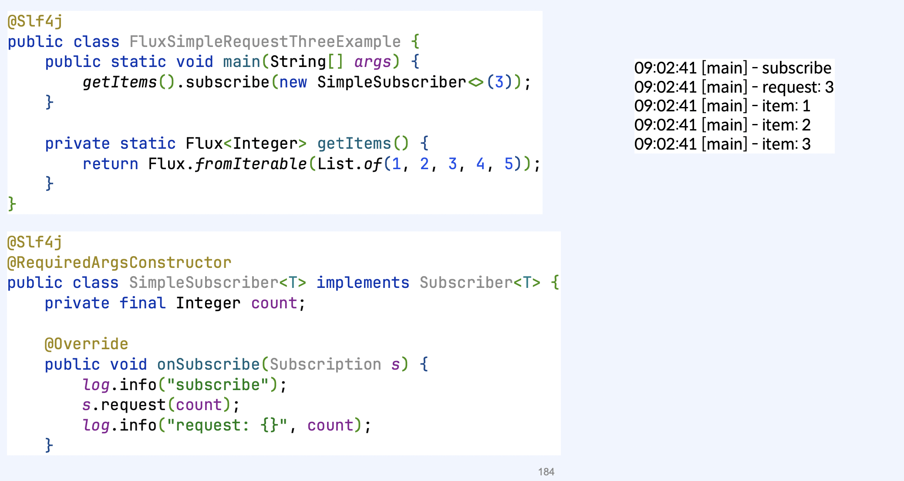
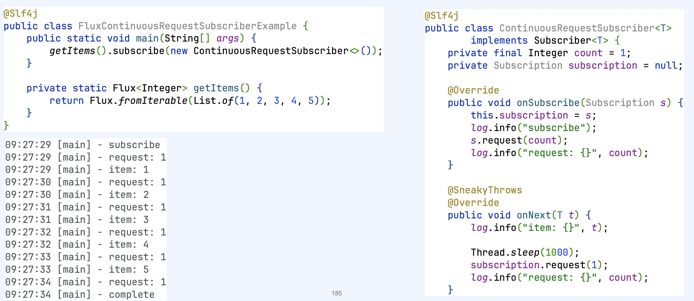
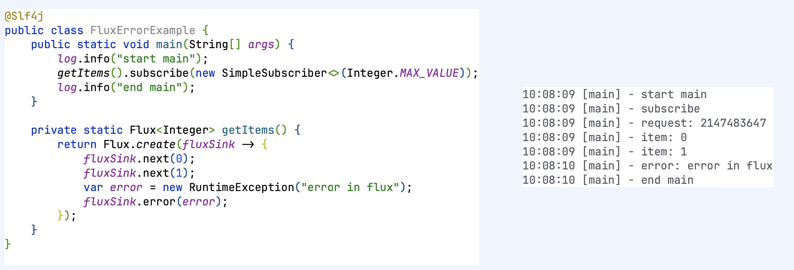
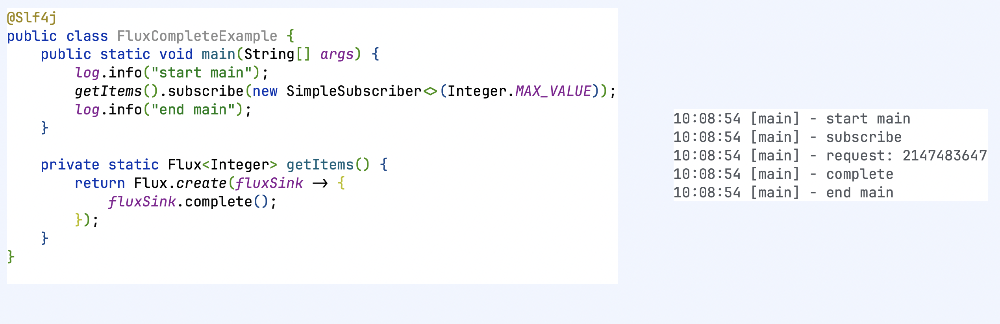
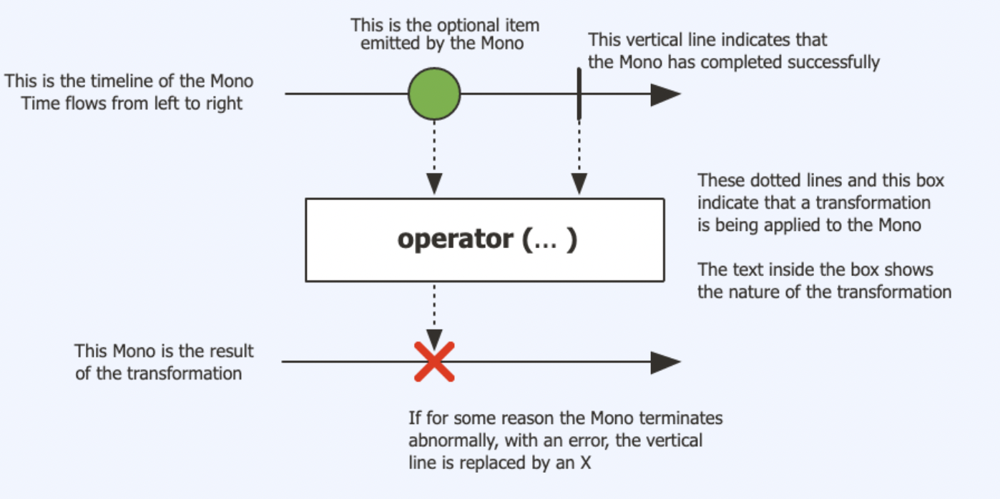

# Reactive streams 구현 라이브러리
- Project reactor
- RxJava
- Mutiny

---

## Project reactor
- Pivotal 사에서 개발
- Spring reactor에서 사용
- Mono와 Flux publisher 제공



## Project reactor - Flux
- 0..n개의 item을 전달
- 에러가 발생하면 error signal 전달하고 종료
- 모든 item을 전달했다면 complete signal 전달하고 종료
- backPressure 지원





### Flux - subscribeOn

subscribe를 다른 스레드에서 실행하고 싶다면 subscribeOn을 사용



### Flux - subscribe

- subscribe 하지 않으면, 이무 일도 일어나지 않음

```java
@Slf4j
public class FluxNoSubscribeExample { 
    public static void main(String[] args) {
        log.info("start main"); getItems(); log.info("end main");
    }

    private static Flux<Integer> getItems() { 
        return Flux.create(fluxSink !-> {
            log.info("start getItems"); 
            for (int i = 0; i < 5; i++) {
                fluxSink.next(i); }
                fluxSink.complete();
                log.info("end getItems"); 
            });
    }
}
```

### Flux - backPressure





### Flux - error



### Flux - complete



## Project reactor - Mono

- 0..1개의 item을 전달
- 에러가 발생하면 error signal 전달하고 종료
- 모든 item을 전달했다면 complete signal 전달하고 종료




## Mono
- 1개의 item만 전달하기 때문에 next하나만 실행하면 complete가 보장
- 혹은 전달하지 않고 complete를 하면 값이 없다는 것을 의미
- 하나의 값이 있거나 없다


### Flux를 Mono로 

- Mono.from으로 Flux를 Mono로 첫번째 값만 전달

```java
public class FluxToMono {
    public static void main(String[] args) {
        Mono.from(getItems()).subscribe(
            new SimpleSubscriber<>(Integer.MAX_VALUE)
        );
    }

    private static Flux<Integer> getItems() {
        return Flux.fromIterable(List.of(1,2,3,4,5));
    }
}

```

- collectList()
- Flux값들을 collect하고 complete 이벤트가 발생하는 시점에 모은 값들을 전달

```java
public class FluxToMono{
    public static void main(String[] args) {
        getItems()
            .colletList()
            .subscribe(
                new SimpleSubscriber<>(Integer.MAX_VALUE)
            );
    }
    private static Flux<Integer> getItems() {
        return Flux.fromIterable(List.of(1,2,3,4,5));
    }
}
```

### Mono를 Flux로
- flux()
- Mono를 next 한 번 호출하고 onComplete를 호출하는 Flux로 변환

```java
class MonoToFlux {
    public static void main(String[] args){
        getItems().flux()
            .subscribe(new SimpleSubscriber<>(Integer.MAX_VALUE));
    }
    private static Flux<Integer> getItems() {
        return Flux.fromIterable(List.of(1,2,3,4,5));
    }    
}
```

- flatMapMany
- Mono의 값으로 여러 개의 값을 전달하는 Flux를 만들고 연결

```Java
public class ListMonoToFlux{
    public static void main(String[] args){
        getItems()
            .flatMapMany(value -> Flux.fromIterable(value))
            .subscribe(new SimpleSubscriber<>(Integer.MAX_VALUE));
    }
    private static Flux<Integer> getItems() {
        return Flux.fromIterable(List.of(1,2,3,4,5));
    }    
}
```