# Java NIO

## 01. Java IO - InputStream

### `함수 호출 모델`

||||
|:--:|:--:|:--:|
||`동기`|`비동기`|
|Blocking|Java IO|X|
|Non-blocking|Java NIO <br/> (File IO는 non-blocking 불가능)|Java AIO|

### `I/O 모델`

||||
|:--:|:--:|:--:|
||`동기`|`비동기`|
|Blocking|Java IO|X|
|Non-blocking|Java NIO, Java AIO|X|


### Java IO
- java 1.0에서 처음 도입
- 파일과 네트워크에 데이터를 읽고 쓸 수 있는 API 제공
- byte 단위로 읽고 쓸 수 있는 stream (InputStream과 OutputStream)
- blocking으로 동작

### InputStream
- closable 구현. 명시적으로 close하거나 try-with-resources 사용가능
- `read`: stream으로 데이터를 읽고, 읽은 값을 반환. -1이라면 끝에 도달했다는 것을 의미
- `close`: stream을 닫고 더 이상 데이터를 읽지 않는다

```java
public abstract class InputStream implements Closeable {
    public abstract int read() throws IOException;
    public void close() throws IOException {}
```

- 어떤 source로부터 데이터를 읽을지에 따라 다양한 구현체 존재
- FileInputStream, ByteArrayInputStream, BufferedInputStream

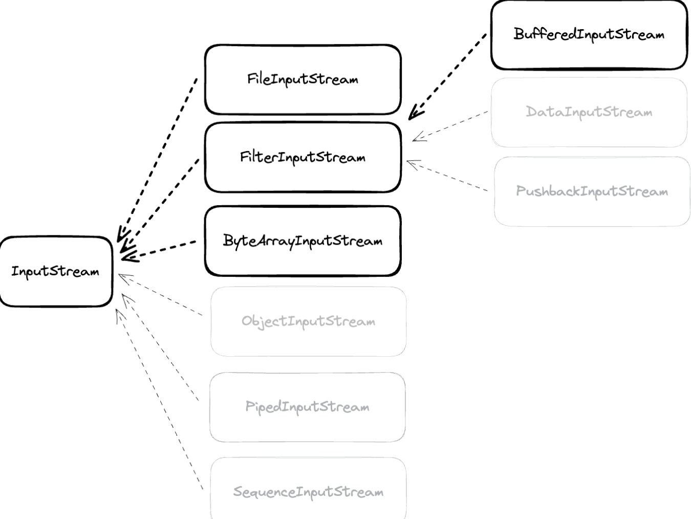

#### ByteArrayInputStream
- byte array로부터 값을 읽을 수 있다
- 메모리가 source가 된다

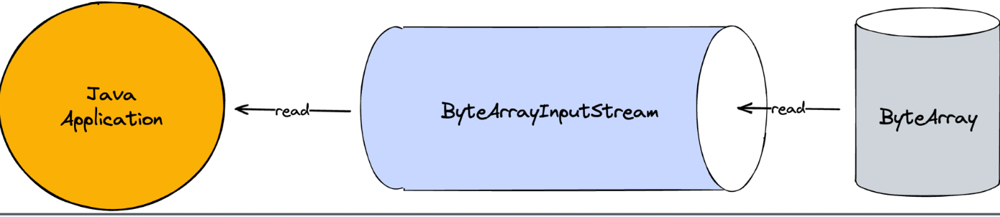

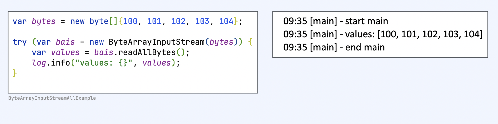

#### FileInputStream
- file로부터 byte단위로 값을 읽을 수 있다
- File 객체나 path를 통해서 FileInputStream을 열 수 있다
- application에서 blocking이 일어난다

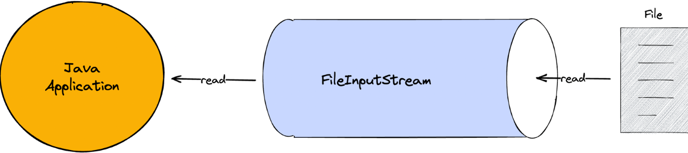
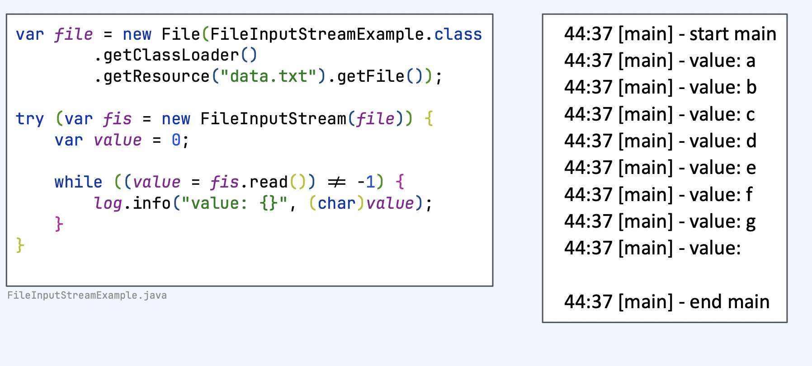

#### BufferedInputStream
- 다른 inputStream과 조합해서 사용
- 임시 저장 공간인 buffer를 사용
- 한 번 read를 호출할 때 buffer 사이즈만큼 미리 조회
- 그 이후 read를 호출할 때 미리 저장한 buffer 데이터 반환

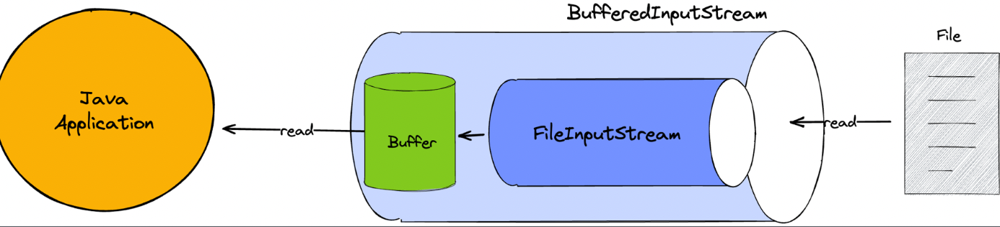
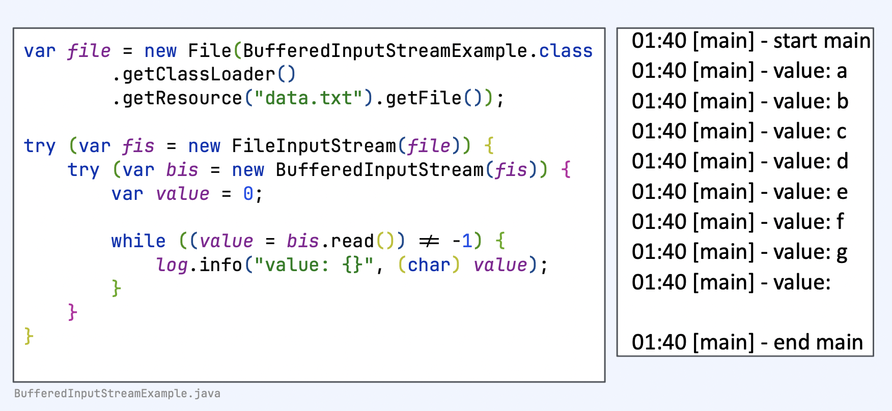

#### serverSocket accept
- serverSocket을 open하여 외부의 요청을 수신
- bind, accept를 통해서 serverSocket open을 준비

#### socket read
- accept가 끝나면 반환값으로 client의 socket을 전달
- client socket의 getInputStream으로 socket의 inputStream에 접근

#### SocketInputStream
- SocketInputStream은public이 아니기때문에 직접 접근이 불가능
- socket.getInputStream으로만 접근 가능 
- blocking이 발생한다

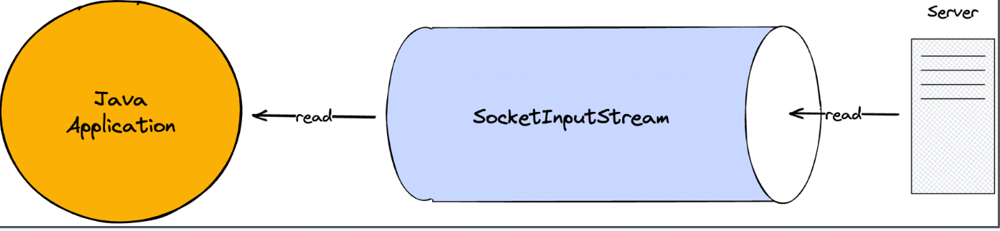
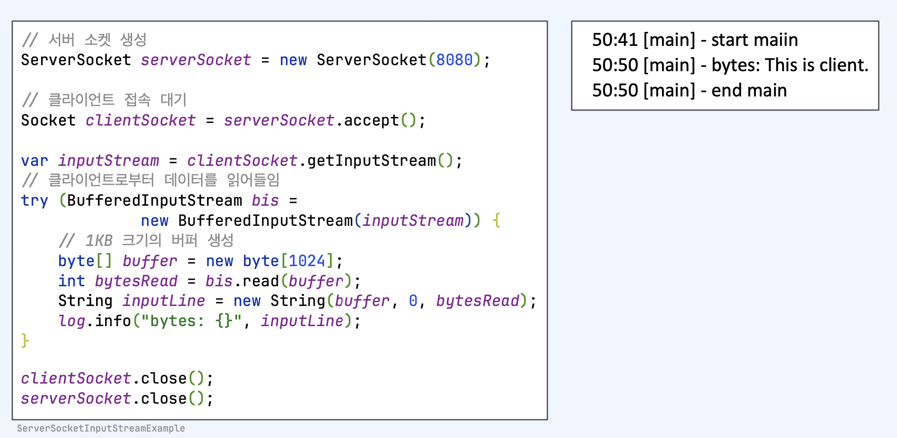

## 02. Java IO - OutputStream

### OutputStream
- write시 바로 전송하지 않고 버퍼에 저장한 다음 일정량의 데이터가 모이면 한번에 전달
- Closable 구현. 명시적으로 close하거나 try-with-resources 사용 가능
- `write`: stream으로 데이터를 쓴다
- `flush`: 버퍼의 모든 데이터를 출력하고 비운다
- `close`: stream을 닫고 더 이상 쓰지 않는다

```java
public abstract class OutputStream implements Closeable, Flushable { public abstract void write(int b) throws IOException;
public void flush() throws IOException {}
public void close() throws IOException {}
```

- 어떤 destination에 데이터를 쓸지에따라 다양한 구현체 존재
- FileOutputStream, ByteArrayOutputStream, BufferedOutputStream

#### ByteArrayOutputStream
- byte array에 값을 쓸 수 있다 
- 메모리가 destination이 된다

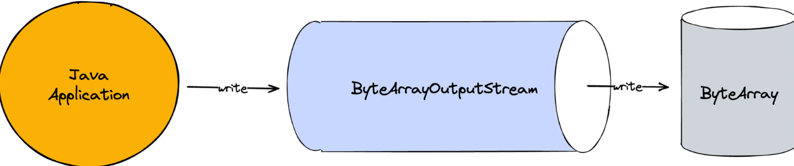
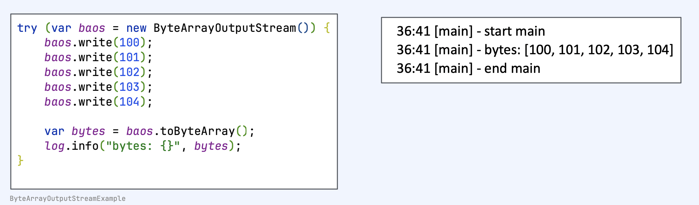

#### FileOutputStream

- file에 값을 쓸 수 있다
- File 객체나 path를통해서 FileOutputStream을 열 수 있다
- application에서 blocking이 일어난다

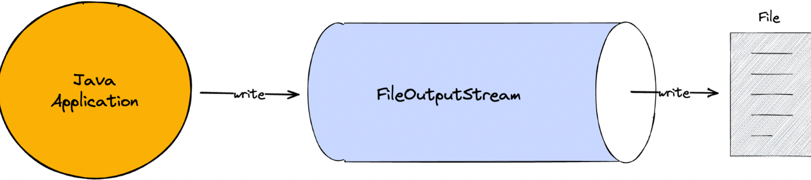
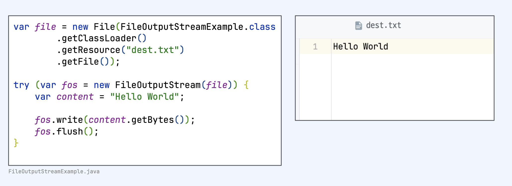

#### BufferedOutputStream
- 다른 outputStream과 조합해서 사용
- Buffer를 사용
- 한번 write를 호출하면 buffer에만 write
- 추후에 flush하여 한번에 outputStream에 write


#### SocketOutputStream
- SocketOutputStream은 public이 아니기때문에 직접 접근이 불가능
- socket.getOutputStream으로만 접근가능 
- blocking이 발생한다

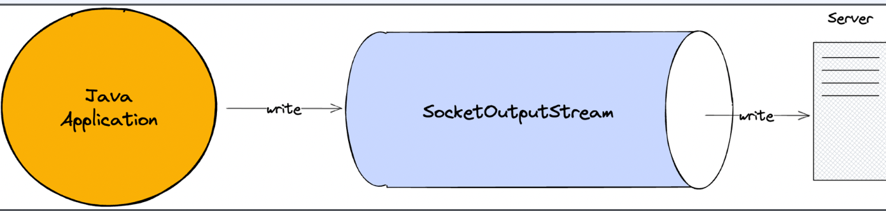
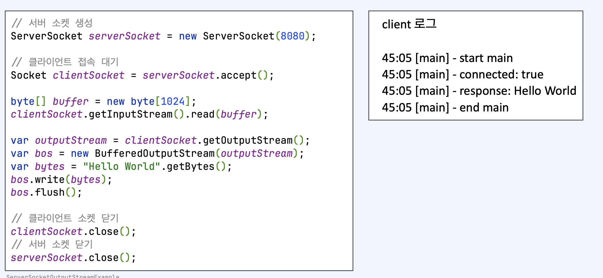

### Java IO Reader와 Writer
- Java 1.1에서 도입
- character 단위로 읽고 쓸 수 있는 stream (Reader와 Writer)
- 문자 인코딩 지원
- blocking으로 동작

## Java IO의 한계
- 동기 blocking으로 동작
- 커널 버퍼에 직접 접근 불가. 따라서 메모리 copy가 발생

### 커널 버퍼에 직접 접근 불가의 의미
- hardware에서 값을 읽어오면, disk controller가 DMA를 통해서 커널 버퍼에 값을 복사
- 커널 버퍼에서 jvm 버퍼로 복사
- 이 과정에서 cpu자원을 소모
- jvm 버퍼, jvm 메모리에 있기 때문에 gc 대상이되고 이는 또한 cpu자원을 소모


### 동기 blocking으로 동작 의미
- application이 read를 호출하면, kernel이 응답을 돌려줄때까지, 아무것도 할 수 없다
-  I/O요청이 발생할때마다 쓰레드를 새로 할당 하면, 쓰레드를 생성 및 관리하는 비용과  
    
    컨텍스트 스위칭으로 인한 cpu 자원 소모
