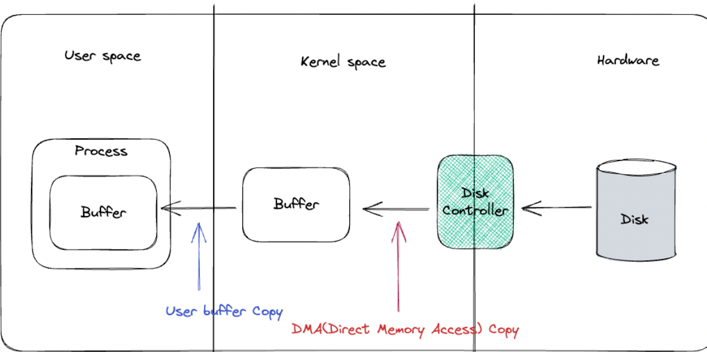
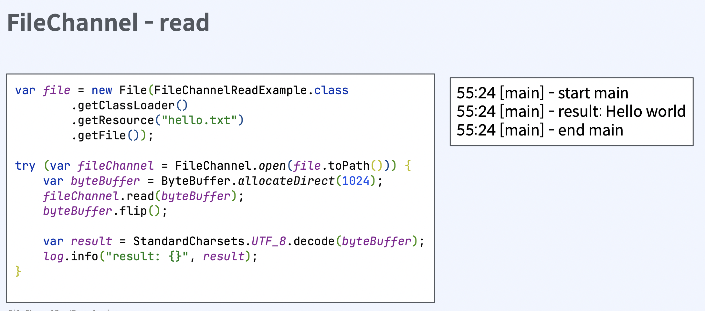
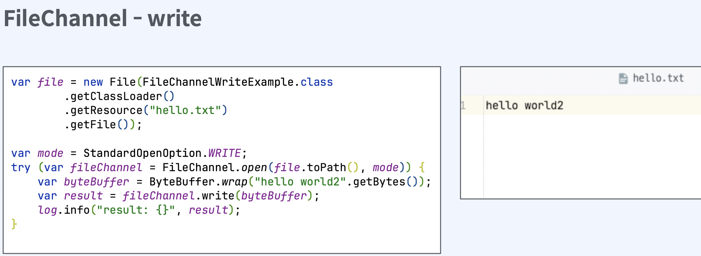
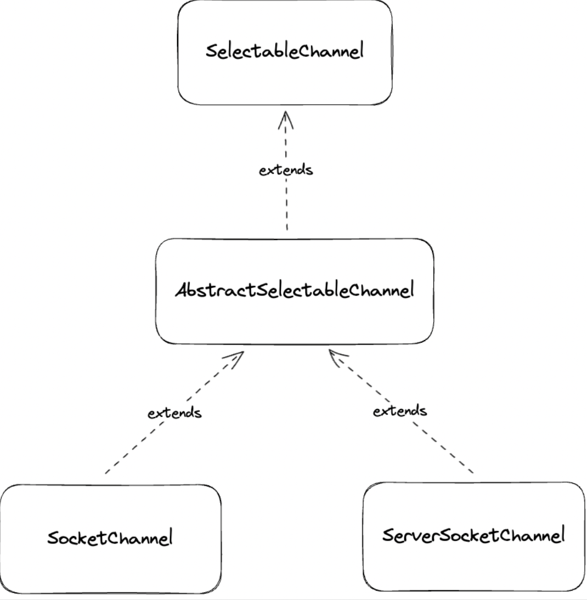

# Java NIO

## 01. Java IO - InputStream

### `함수 호출 모델`

||||
|:--:|:--:|:--:|
||`동기`|`비동기`|
|Blocking|Java IO|X|
|Non-blocking|Java NIO <br/> (File IO는 non-blocking 불가능)|Java AIO|

### `I/O 모델`

||||
|:--:|:--:|:--:|
||`동기`|`비동기`|
|Blocking|Java IO|X|
|Non-blocking|Java NIO, Java AIO|X|


### Java IO
- java 1.0에서 처음 도입
- 파일과 네트워크에 데이터를 읽고 쓸 수 있는 API 제공
- byte 단위로 읽고 쓸 수 있는 stream (InputStream과 OutputStream)
- blocking으로 동작

### InputStream
- closable 구현. 명시적으로 close하거나 try-with-resources 사용가능
- `read`: stream으로 데이터를 읽고, 읽은 값을 반환. -1이라면 끝에 도달했다는 것을 의미
- `close`: stream을 닫고 더 이상 데이터를 읽지 않는다

```java
public abstract class InputStream implements Closeable {
    public abstract int read() throws IOException;
    public void close() throws IOException {}
```

- 어떤 source로부터 데이터를 읽을지에 따라 다양한 구현체 존재
- FileInputStream, ByteArrayInputStream, BufferedInputStream


#### ByteArrayInputStream
- byte array로부터 값을 읽을 수 있다
- 메모리가 source가 된다


#### FileInputStream
- file로부터 byte단위로 값을 읽을 수 있다
- File 객체나 path를 통해서 FileInputStream을 열 수 있다
- application에서 blocking이 일어난다


#### BufferedInputStream
- 다른 inputStream과 조합해서 사용
- 임시 저장 공간인 buffer를 사용
- 한 번 read를 호출할 때 buffer 사이즈만큼 미리 조회
- 그 이후 read를 호출할 때 미리 저장한 buffer 데이터 반환


#### serverSocket accept
- serverSocket을 open하여 외부의 요청을 수신
- bind, accept를 통해서 serverSocket open을 준비

#### socket read
- accept가 끝나면 반환값으로 client의 socket을 전달
- client socket의 getInputStream으로 socket의 inputStream에 접근

#### SocketInputStream
- SocketInputStream은public이 아니기때문에 직접 접근이 불가능
- socket.getInputStream으로만 접근 가능 
- blocking이 발생한다


## 02. Java IO - OutputStream

### OutputStream
- write시 바로 전송하지 않고 버퍼에 저장한 다음 일정량의 데이터가 모이면 한번에 전달
- Closable 구현. 명시적으로 close하거나 try-with-resources 사용 가능
- `write`: stream으로 데이터를 쓴다
- `flush`: 버퍼의 모든 데이터를 출력하고 비운다
- `close`: stream을 닫고 더 이상 쓰지 않는다

```java
public abstract class OutputStream implements Closeable, Flushable { public abstract void write(int b) throws IOException;
public void flush() throws IOException {}
public void close() throws IOException {}
```

- 어떤 destination에 데이터를 쓸지에따라 다양한 구현체 존재
- FileOutputStream, ByteArrayOutputStream, BufferedOutputStream

#### ByteArrayOutputStream
- byte array에 값을 쓸 수 있다 
- 메모리가 destination이 된다


#### FileOutputStream

- file에 값을 쓸 수 있다
- File 객체나 path를통해서 FileOutputStream을 열 수 있다
- application에서 blocking이 일어난다


#### BufferedOutputStream
- 다른 outputStream과 조합해서 사용
- Buffer를 사용
- 한번 write를 호출하면 buffer에만 write
- 추후에 flush하여 한번에 outputStream에 write


#### SocketOutputStream
- SocketOutputStream은 public이 아니기때문에 직접 접근이 불가능
- socket.getOutputStream으로만 접근가능 
- blocking이 발생한다


### Java IO Reader와 Writer
- Java 1.1에서 도입
- character 단위로 읽고 쓸 수 있는 stream (Reader와 Writer)
- 문자 인코딩 지원
- blocking으로 동작

## Java IO의 한계
- 동기 blocking으로 동작
- 커널 버퍼에 직접 접근 불가. 따라서 메모리 copy가 발생

### 커널 버퍼에 직접 접근 불가의 의미
- hardware에서 값을 읽어오면, disk controller가 DMA를 통해서 커널 버퍼에 값을 복사
- 커널 버퍼에서 jvm 버퍼로 복사
- 이 과정에서 cpu자원을 소모
- jvm 버퍼, jvm 메모리에 있기 때문에 gc 대상이되고 이는 또한 cpu자원을 소모



### 동기 blocking으로 동작 의미
- application이 read를 호출하면, kernel이 응답을 돌려줄때까지, 아무것도 할 수 없다
-  I/O요청이 발생할때마다 쓰레드를 새로 할당 하면, 쓰레드를 생성 및 관리하는 비용과  
    
    컨텍스트 스위칭으로 인한 cpu 자원 소모

---

## Java NIO

### Java NIO
- java New Input/Output (non-blockign X)
- java 1.4에서 처음 도입
- 파일과 네트워크에 데이터를 읽고 쓸 수 있는 API 제공
- buffer 기반
- non-blocking 지원
- selector, channel 도입으로 높은 성능 보장

### Java NIO vs Java IO

||||
|:--:|:--:|:--:|
||Java NIO| Java IO|
|데이터의 흐름|양방향|단방향|
|종류|Channel|InputStream, OutputStream|
|데이터의 단위|buffer|byte 혹은 character|
|blocking 여부|non-blocking지원<br/>(blocking한 API도 존재)|blocking만 가능|
|특이사항|Selector 지원||


### Channel과 Buffer
- 데이터를읽을때:적절한크기의 Buffer를 생성하고 Channel의 read() 메서드를 사용하여 데이터를 Buffer에 저장.
- 데이터를쓸때:먼저Buffer에 데이터를 저장하고 Channel의 write() 메서드를 사용하여 목적지로 전달
- clear()메서드로 초기화하여 다시 사용가능


`Buffer 종류`
- ByteBuffer: byte 단위로 데이터를 읽고 쓴다 
- CharBuffer: char 단위
- ShortBuffer: short 단위
- IntBuffer: int 단위
- LongBuffer: long 단위
- FloatBuffer: float 단위
- DoubleBuffer: double 단위

### Buffer 위치 속성

-  capacity: Buffer가 저장할 수 있는 데이터의 최대 크기. Buffer 생성시 결정되며 변경 불가
- position: Buffer에서 현재 위치를 카리킨다.버퍼에서 데이터를 읽거나 쓸 때,해당위치부터 시작. 
  
  Buffer에 1Byte가 추가될 때마다 1 증가
- limit: Buffer에서 데이터를 읽거나 쓸 수 있는 마지막 위치. limit 이후로 데이터를 읽거 나 쓰기 불가. 

    최초 생성시 capacity와 동일
- mark:현재 position 위치를 mark()로 지정 할 수 있고 reset() 호출 시 position을 mark로 이동
- 0 <= mark <= position <= limit <= capacity

`DirectByteBuffer`
- native 메모리(off-heap)에 저장
- 커널 메모리에서 복사를 하지 않으므로 데이터를 읽고 쓰는속도가빠르다

- 비용이 많이 드는 system call을 사용하므로allocate, deallocate가 느리다
  
`HeapByteBuffer`
- JVM heap 메모리에 저장. byte array를 랩핑 
- 커널 메모리에서 복사가 일어나므로 데이터를 읽고 쓰는 속도가 느리다
- (이 과정에서 임시로 Direct Buffer를 만들기때문에 성능 저하)
- gc에서 관리가 되므로 allocate, deallocate가 빠르다

### ByteBuffer 구분
- DirectByteBuffer: allocateDirect() 함수로 생성 가능
- HeapByteBuffer: allocate(), wrap() 함수로 생성 가능
- isDirect()로 구분 가능

```java
var directByteBuffer = ByteBuffer.allocateDirect(1024); 
assert directByteBuffer.isDirect();
var heapByteBuffer = ByteBuffer.allocate(1024); 
assert !heapByteBuffer.isDirect();
var byteBufferByWrap = ByteBuffer.wrap("hello".getBytes()); 
assert !byteBufferByWrap.isDirect();
```






## Java NIO를 non-blocking하게 쓰려면?

### SelectableChannel
- SocketChannel, ServerSocketChannel 모 두 AbstractSelectableChannel을 상속
- AbstractSelectableChannel은 SelectableChannel을 상속



- configureBlocking과 register 함수 제공
- configureBlocking : serverSocketChannel의 accept, socketChannel의 connect등이 non-blocking으로 동작

```java
public abstract class SelectableChannel extends AbstractInterruptibleChannel
implements Channel

public abstract SelectableChannel configureBlocking(boolean block) throws IOException;
public final SelectionKey register(Selector sel, int ops) throws ClosedChannelException { ... }
}
```

### ServerSocketChannel - non-Blocking accept

```java
try (var serverChannel = ServerSocketChannel.open()) {
    var address = new InetSocketAddress("localhost", 8080); 
    serverChannel.bind(address); 
    serverChannel.configureBlocking(false);
    var clientSocket = serverChannel.accept();
    assert clientSocket == null; 
}
```

### SocketChannel - non-Blocking connect

```java
try (var socketChannel = SocketChannel.open()) {
    var address = new InetSocketAddress("localhost", 8080); 
    socketChannel.configureBlocking(false);
    var connected = socketChannel.connect(address);
    assert !connected;
}
```

### FileChannel

```java
public abstract class FileChannel
    extends AbstractInterruptibleChannel
    implements SeekableByteChannel, GatheringByteChannel, ScatteringByteChannel
{
    //...
}
```