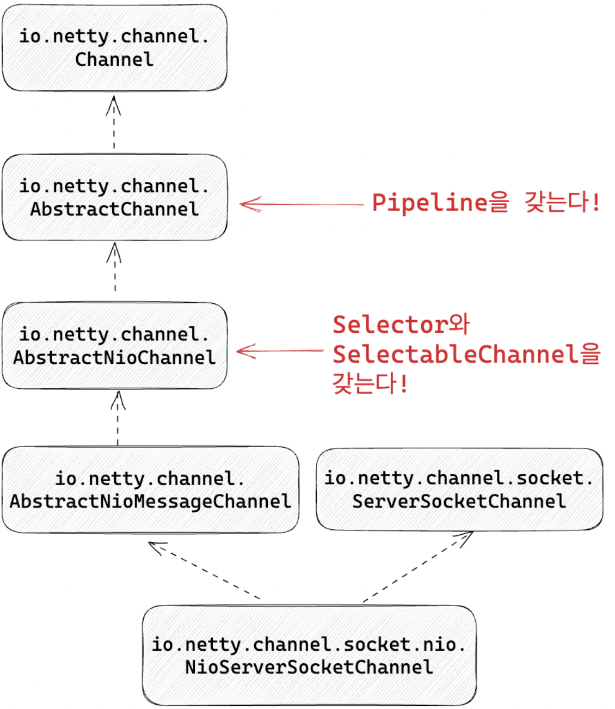

# Chap02 Spring Webflux

## Spring servlet stack

### Servlet containers 구조
- `request-per-thread` 모델을 사용하여 요청이 들어올때마다 쓰레드를 할당하여 여러 클라이언트 요청을 동시 처리
- Connector를 통해서 HTTP 통신을 수행
- Filter는 각 요청, 응답의 내용과 헤더를 변환
- 클라이언트의 요청을 Servlet의 service메소드에 넘겨주고 그 결과를 응답으로 전달
- Servlet의 init과 destroy 메소드로 생명주기를 담당

### Servlet
- Java EE Servlet에서 정의 (현재는 Jakarta EE Servlet에서 지원)
- init: Servlet을 초기화할 때 사용. Servlet 객 체를 생성할 때 사용되며 이후 Servlet Container에 등록
- service: 클라이언트의 요청에 따라서 비즈니스 로직을 실행하고 응답 반환
- destroy: Servlet 종료시 수행. 리소스 해제 등을 맡는다
```java
public interface Servlet {

    public void init(ServletConfig config) throws ServletException;

    public void service(ServletRequest req, ServletResponse res)
            throws ServletException, IOException;
    public void destroy();
    }
```

### HttpServlet service
- Servlet을 기반으로 HTTP 프로토콜을 지원
- HTTP 요청 처리에 특화된 기능 제공
- GET, POST, PUT, DELETE, HEAD, OPTION, TRACE등을 구현

### DispatcherServlet
- 클라이언트의 요청을 적절한 컨트롤러에게 전달
- 프론트 컨트롤러 패턴을 구현
- HttpServlet을 상속하여 모든 요청을 doDispatch 호출하게 변경
- HandlerMapping, HandlerAdapter, ViewResolver등과 상호작용

## Spring servlet stack 정리
- Thread-per-request모델을 사용하여 요청이 들어올때마다 쓰레드를 할당하여 여러 클라 이언트 요청을 동시에 처리
- SecurityContext를 ThreadLocal에저장
- 쓰레드당하나의db요청을처리
 
    ->요청이 들어올때마다 할당된 쓰레드는 spring mvc flow, 비즈니스 로직 수행, 
    
    response 생성, SecurityContext 관리, db 요청, http 요청 등 긴 활동주기를 갖는다


### Question
- 만약 1만개 혹은 그 이상의 클라이언트 요청이 동시에 들어온다면?
  - Servlet container의ㅣ 쓰레드풀 크기 제한
  - 동기 blocking한 연산들로 인해서 작업을 완료하고 반환되는 쓰레드 수보다 요청 수가 더 많아진다

`그렇다면 쓰레드 풀을 사용하지 않는다면?`
- 쓰레드풀을 사용하지 않고 매번 쓰레드를 만든다면?
  - 쓰레드를 생성하고 제거하는 비용이 비싸다. 시스템 자원 소모가 커지고 성능 저하 발생
  - 쓰레드마다 할당되는 스택 메모리로 인해서 메모리 부족 문제 발생
  - 더 많은 쓰레드가 cpu를 점유하기 위해 컨텍스트 스위칭을 하게 된다


---
# ch2. Netty


## Netty

- 비동기이벤트 기반의 네트워크 어플리케이션 프레임워크
- HTTP뿐만 아니라 다양한 프로토콜 지원
- Java IO, NIO, selector 기반으로 적은 리소스로 높은 성능 보장
- 불필요한 메모리copy를 최소한으로
- 유연하며 확장가능한 이벤트 모델 기반
- 서버와 클라이언트 모두 지원

### NIOEventLoop
- EventExecutor, TaskQueue, Selector를 포 함
- EventExecutor: task를 실행하는 쓰레드풀
- TaskQueue: task를 저장하는 queue.

    eventExecutor가 즉시 task를 수행하지 않고 taskQueue에 넣은 후, 나중에 꺼내서 처리 가능
- Selector: I/O Multiplexing을 지원


`NIOEventLoop의 task`

- I/O task와 Non I/O task로 구분

- I/O task: register를 통해서 내부의 selector에 channel을 등록하고 I/O 준비 완료 

    이벤트가 발생하면 channe의 pipeline 실행
- Non I/O task: task queue에서 Runnable 등 실행 가능한 모든 종류의 task를 꺼내서 실행

`NIOEventLoop의 I/O task`
- NIOEventLoop를 직접 생성할 수 없기 때문에 NIOEventLoopGroup 사용
- Nio를 수행하는 ServerSocketChannel을 생성하고 accept network I/O 이벤트를 eventLoop에 등록
- 하나의eventLoopGroup에 여러개의 chanel 등록 가능
- I/O이벤트완료시 channel의 pipeline실행

```java
var channel = new NioServerSocketChannel(); 
var eventLoopGroup = new NioEventLoopGroup(1); 
eventLoopGroup.register(channel);
channel.bind(new InetSocketAddress(8080)).addListener(future -> {

    if (future.isSuccess()) { 
        log.info("Server bound to port 8080");
    } else {
        log.info("Failed to bind to port 8080");
        eventLoopGroup.shutdownGracefully(); 
    }
});
```

`NIOEventLoop의 Non I/O task`
- 일반적인 Executor처럼 Non I/O task 수행 
- 하나의 쓰레드에서 돌기 때문에 순서가 보장

```java
EventLoopGroup eventLoopGroup = new NioEventLoopGroup(1);
for (int i = 0; i < 10; i++) { 
    final int idx = i; eventLoopGroup.execute(() -> {
        log.info("i: {}", idx); 
    });
} 
eventLoopGroup.shutdownGracefully();
```

`EventLoopGroup`
- EventLoop를 포함하는 group
- 생성자를 통해서 내부에 몇 개의 EventLoop를 포함할지 설정 가능
- group에서 execute는 eventLoopGroup 내의 eventLoop를 순회하면서 execute 실행
- 각각의 eventLoop에 순차적으로 task가 추가되고 실행하기 때문에 eventExecutor 단위로 놓고 보면 순서 보장

```java
EventLoopGroup eventLoopGroup = new NioEventLoopGroup(5);
for (int i = 0; i < 12; i++) { 
    final int idx = i; eventLoopGroup.execute(() -> {
        log.info("i: {}", idx); 
    });
} 
eventLoopGroup.shutdownGracefully();
```

### Channel

`ChannelFuture`
- Channel I/O 작업이 완료되면 isDone이 true 가 되는 Future
- futureListener 등록/삭제를 지원하여 비동기 가능
- addListener: Channel I/O 작업이 완료되면 수행할 futureListener 등록
- removeListener:등록된futureListener제거
- sync:작업이 완료될때까지 blocking

```java
public interface ChannelFuture extends Future<Void> {
    /**
     * Returns a channel where the I/O operation associated with this
     * future takes place.
     */
    Channel channel();

    @Override
    ChannelFuture addListener(
        GenericFutureListener<? extends Future<? super Void>> listener);
    @Override
    ChannelFuture removeListener(
        GenericFutureListener<? extends Future<? super Void>> listener);
    @Override
    ChannelFuture sync() throws InterruptedException;
```

`NioServerSocketChannel`

- netty에서는 java nio의 Channel을 사용하지 않고 거의 자체 구현
- Channel, ServerSocketChannel 모두 자체 구현
- AbstractChannel: ChannelPipeline을 갖는다
- AbstractNioChannel:내부적으로 java.nio.ServerSocketChannel을 저장하고 
  
  register할 때 java nio Selector에 등록



`ChannelPipeline`

- Channel의 I/O이벤트가 준비되면, EventLoop가 pipeline 실행
  - I/O task에 해당
- pipeline에서는 결과로I/O작업을 수행
- 전파되는(inbound) I/O 이벤트와 수행하는 (outbound) I/O 작업은 여러 가지 종류가 있지만..
- 대부분의경우
  - ChannelPipeline으로 I/O read 이벤트가 전파되고
  - ChannelPipeline은 I/O write 작업을 수행한다


`ChannelPipeline 내부`
- pipeline는 ChannelHandlerContext의 연속
- Head context와 Tail context 기본적으로 포함
- 각각의 context는LinkedList 형태로 next, prev를 통해서 이전 혹은 다음 context에 접 근가능
- 모든 inbound I/O 이벤트는 next로
- 모든 outbound I/O 작업은 prev로


`ChannelHandlerContext 내부`
- ChannelHandlerContext는 EventExecutor와 ChannelHandler를 포함
- ChannelHandler는 I/O이벤트를 받아서
  - 다음 context에게 넘겨줄 수도 있고
  - 다음 context에게 넘겨주지 않고 I/O작업을 수행 할 수도 있다


`ChannelHandlerContext와 EventExecutor`
- ChannelHandler에서 시간이 오래 걸리는 연산을 진행한다면?
  - EventLoop 쓰레드에서 해당 ChannelHandler에서 blocking
  - EventLoop에 등록된 다른 Channel의 I/O처리 또한 blocking
  - 해당 ChannelHandler에서는 EventLoop쓰레드가 아닌 다른 쓰레드풀을 사용한다면?
- 이를 위해서 ChannelHandlerContext에 등록된EventExecutor가있다면
  - next context가 다른 쓰레드풀에서 동작해야하는구나 라고 판단
  - 직접 이벤트처리를 호출하지 않고executor.execute로taskQueue에넣고EventLoop쓰레드
는 복귀

`EventExecutor`
- 특정 context에서 next context로 이벤트를 전파하는 상황에서
-  쓰레드가 다르다면 next executor의 task queue에 이벤트 처리를 추가
-  쓰레드가 같다면 해당 쓰레드가 직접 이벤트 처리를 실행


```java
static void invokeChannelRead(final AbstractChannelHandlerContext next, Object msg) { 
    final Object m = next.pipeline.touch(ObjectUtil.checkNotNull(msg, "msg"), next); 
    EventExecutor executor = next.executor();

    if (executor.inEventLoop()) {
        next.invokeChannelRead(m); 
    } else {
        executor.execute(new Runnable() { 
            @Override
            public void run() {
                next.invokeChannelRead(m); 
            }
        }); 
    }
}
 

```

`ChannelHandler`
- Channel의 I/O이벤트를 처리하거나 I/O작업을 수행하는 handler
- ChannelInboundHandler와 ChannelOutboundHandler
- ChannelInboundHandler: Channel I/O 이벤트를 수행
- ChannelOutboundHandler: Channel I/ O작업을수행
- ChannelDuplexHandler: ChannelInboundHandler와 ChannelOutboundHandler 모두 구현

`ChannelInboundHandler`
- inbound I/O 이벤트를 처리하기 위한 handler
- channelRegistered: channel이 eventLoop에 등록되는 경우
- channelUnregistered: channel이 eventLoop에서 제거되는 경우
- channelActive: channel이 active되는 경우
- channelInactive: channel이 inactive되고 close되는 경우
- channelRead: channel로부터 메시지를 읽을 준비가 된 경우
- channelReadComplete: channelRead를 통해서 모든 메시지를 읽은 경우
- userEventTriggered: user event가 트리거된 경우
- channelWritabilityChanged: channel이 쓸 수 있는 상태가 변경된 경우.


`ChannelOutboundHandler`
- outbound I/O 작업을 가로채서 처리하는 handler
- bind: serverSocketChannel에 bind 요청 시 호출
- connect: socketChannel이 connect 요청 시 호출
- disconnect: socketChannel이 disconnect 요청 시 호출
- deregister: eventLoop로부터 deregister되면 호출
- read: channel에 대한 read 요청 시 호출
- write: channel에 대한 write 요청 시 호출. 나중에 작업하는 handler가 이전 메세지를 다른 값으로 변경 할 수 있다
- flush: flush 작업이 수행된 경우 호출
- close: channel이 닫히면 호출


`Pipeline read 이벤트 전파`
- 현재의 context와 이전값이 주어지고
- fireChannelRead:다음 context로 read 이벤트를 전달할 수 있다. msg를 변경해서 다른

    값을 수정후 전달 가능
- writeAndFlush: channel로 write 작업을 전달할수있다


```java
public class SampleInboundChannelHandler
        extends ChannelInboundHandlerAdapter {
    @Override
    public void channelRead(ChannelHandlerContext ctx, Object msg) { 
        if (msg instanceof String) {
        // 다음 context로 이벤트를 전달하지 않고
        // outbound I/O 작업을 수행한 후 채널을 닫음 
        ctx.writeAndFlush("Hello, " + msg).addListener(ChannelFutureListener.CLOSE); 
        } else if (msg instanceof ByteBuf) {
            // 별도의 outbound I/O 작업을 수행하지 않고 다음 context로 이벤트를 전달 
            // msg를 변형해서 전달 가능
            try {
                var buf = (ByteBuf) msg;
                var len = buf.readableBytes();
                var charset = StandardCharsets.UTF_8;
                var body = buf.readCharSequence(len, charset); 
                ctx.fireChannelRead(body);
            } finally {
                ReferenceCountUtil.release(msg); 
            }
        } 
    }
}
```

`Pipeline write 이벤트 수행`
- outbound로 수행하는 I/O를 가로챌 수 있다 
- 메세지를 변경하여 write가능


```java
public class SampleChannelOutboundHandler extends ChannelOutboundHandlerAdapter {
    @Override
    public void write(ChannelHandlerContext ctx, Object msg, ChannelPromise promise) {
        if (msg instanceof String) {
            ctx.write(msg, promise);
        } else if (msg instanceof ByteBuf) {
            var buf = (ByteBuf) msg;
            var len = buf.readableBytes();
            var charset = StandardCharsets.UTF_8;
            var body = buf.readCharSequence(len, charset); 
            ctx.write(body, promise);
        } 
    }
}
```