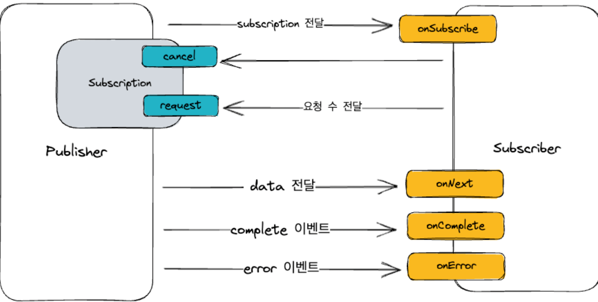

# Reactor

## Reactor 복습

### Reactive Streams
- 비동기 데이터 스트림 처리를 위한 표준
- Publisher는 Subscriber에게 비동기적으로 이벤트를 전달
- `onSubscribe`: subscriber가 publisher 사이에 연결이 시작될때 호출.Subscription 객체를 전달
- `onNext`: Publisher가 데이터를 생성하고 Subscriber에게 전달. Subscriber는 데이터를 받고 처리
- `onComplete`: 모든 아이템이 전달 완료.더 이상 전달할 데이터가 없을때 호출. 
  
    Publisher와 Subscriber의 연결이 종료
- onError: 데이터 스트림 처리 중 오류가발생 했을 때 호출. 

    오류 정보를 전달하고 Publisher 와 Subscriber의 연결이 종료



### Subscription
- `request` : Subscriber가 Publisher에게 n개의 데이터를 요청. Subscriber가 처리 가능한만큼만 요청
- `cancel` : Subscriber가 데이터 요청을 취소하고 연결을 종료. Subscriber가 더 이상 데이터를 받지 않거나

    에러가 발생한 경우 호출

```java
public static interface Subscription {
    public void request(long n);
    public void cancel();
}
```

### Reactor Publisher

- Reactor에서 Mono와 Flux제공
- CorePublishser는 reactive streams의 Publishser를 구현
- reactive streams와 호환

### Flux

- 0..n개의 item을 subscriber에게 전달
- subscriber에게 onComplete, onError signal을 전달하면 연결 종료
- 모든 event가 optional 하기 때문에 다양한 flux 정의 가능. 심지어 onComplete도 optional
- onComplete를 호출하지 않으면 infinite한 sequence 생성 가능

### Mono

- 0..1개의item을subscriber에게전달
- subscriber에게 onComplete, onError signal을 전달하면 연결 종료
- 모든 event가 optional
- onNext가 호출 되면 곧바로 onComplete 이벤트 전달
- Mono< Void>를 통해서 특정 사건의 완료를 전달가능


#### Q. Mono는 언제 사용 하는게 좋을까?
- 반드시 하나의 값 혹은 객체를 필요로 하는경우 
  - 유저가 작성한 게시글의 숫자
  - http 응답 객체
- 있거나 혹은 없거나 둘 중 하나인 경우 
  - 특정 id를 갖는 유저 객체
- 완료된 시점을 전달해야 하는 경우
- 유저에게 알림을 보내고 완료된 시점을 전달

- Publisher에서는 onNext 이후 바로 onComplete를 호출하면 되기 때문에 구현이 더 간단
- Subscriber의 경우도 최대 1개의 item이 전달된다는 사실을 알고 있기 때문에 더 간결한 코드 작성 가능