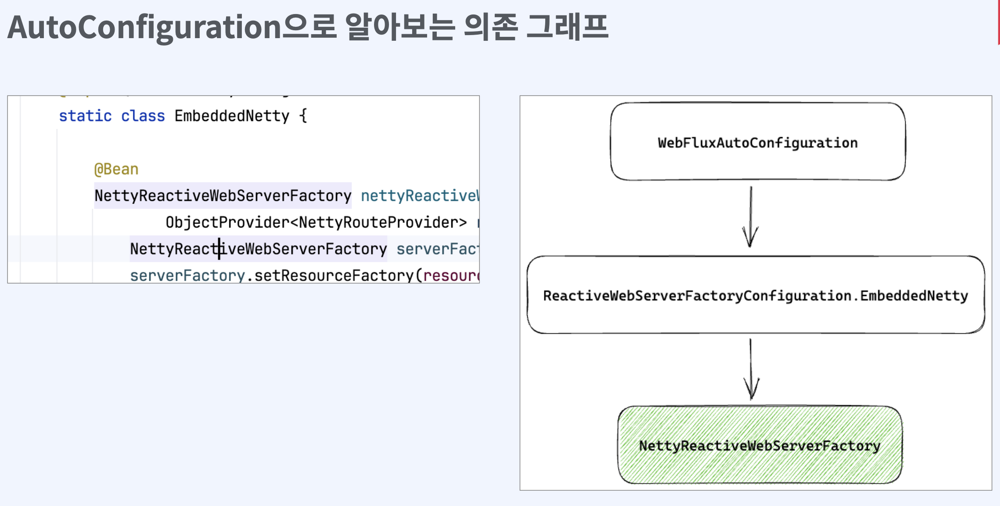

## Spring webflux 구조





### AutoConfiguration으로 알아보는 의존 그래프

```java
import reactor.netty.http.HttpProtocol;
import reactor.netty.http.server.HttpServer;
import reactor.netty.resources.LoopResources;
public class NettyReactiveWebServerFactory extends AbstractReactiveWebServerFactory {
   @Override
    public WebServer getWebServer(HttpHandler httpHandler) {
        HttpServer httpServer = createHttpServer();
        ReactorHttpHandlerAdapter handlerAdapter = new ReactorHttpHandlerAdapter(httpHandler); 
        
        NettyWebServer webServer = createNettyWebServer(httpServer, handlerAdapter, this.lifecycleTimeout,getShutdown()); 
        
        webServer.setRouteProviders(this.routeProviders); 
        
        return webServer;
}
```

### Reactor Netty
- Reactor 기반으로 Netty를 wrapping
- Netty의 성능과 Reactor의 조합성, 편의성모두 제공

```java
Consumer<HttpServerRoutes> routesConsumer = routes -> routes.get("/hello", (request, response) -> {
    var data = Mono.just("Hello World!");

    return response.sendString(data); 
    }
);

HttpServer.create() .route(routesConsumer)
        .port(8080)
        .bindNow()
        .onDispose()
        .block();
```

#### Q. Spring webflux는 어떻게 RxJava, Mutiny, Coroutine을 지원할까?


`ReactiveAdapter`
- ReactiveAdapterRegistry는 내부적으로 각각 라이브러리의 Publisher에 매칭되는

    변환함수를 Adapter 형태로 저장

```java
public void registerReactiveType(ReactiveTypeDescriptor descriptor, Function<Object, Publisher<?>> toPublisherFunction, 
Function<Publisher<?>, Object> fromPublisherFunction) {
    if (reactorPresent) {
        this.adapters.add(new ReactorAdapter(descriptor, toPublisherFunction, fromPublisherFunction)); }
    else {
        this.adapters.add(new ReactiveAdapter(descriptor, toPublisherFunction, fromPublisherFunction));
    }
}
```

- getAdapter를통해서변환하 고자는 Publisher를 넘기고 해당 adapter의 toPublish를 이용하여, 

    reactive streams 의 Publisher로 변경

```java
ReactiveAdapter adapter = getAdapterRegistry().getAdapter(null, attribute); 

if (adapter != null) {
    return Mono.from(adapter.toPublisher(attribute)); 
} else {
    return Mono.justOrEmpty(attribute); 
}
```

`ReactiveAdapter`

- 여러 라이브러리의 Publisher들을 reactive streams의 Publisher로 변 환가능
- Spring webflux에서는 reactive steams의 Publisher 기준으로 구현을 

    한다면 ReactiveAdapter를 통해서 여 러 라이브러리 지원 가능